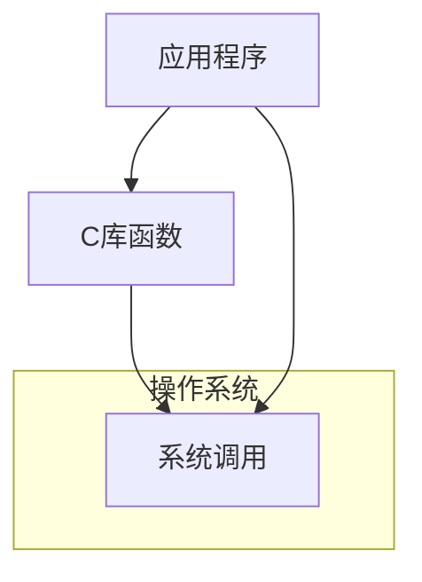
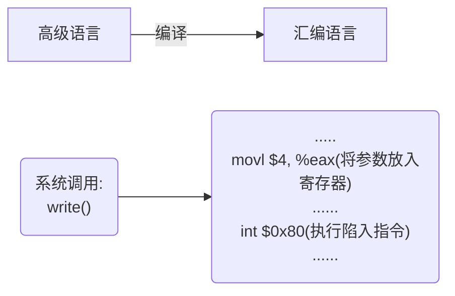

# 系统调用

应用程序通过==**系统调用**==请求操作系统的服务。系统中的各种共享资源都由操作系统统一掌管，因此在用户程序中，凡是与资源有关，影响其它进程的操作（如存储分配，I/O操作，文件管理等），都必须通过系统调用的方式向操作系统提出服务请求，由操作系统代为完成。这样**可以保证系统的稳定性和安全性**，防止用户进行非法操作 
$$
系统调用（按功能分类）\begin{cases}  
设备管理&完成设备的请求/释放/启动等功能\\  
文件管理&完成文件的读/写/创建/删除等功能\\
进程控制&完成进程的创建/撤销/阻塞/唤醒等功能\\
进程通信&完成进程之间的消息传递/信号传递等功能\\
内存管理&完成内存的分配/回收等功能
\end{cases} 
$$

由于系统调用相关处理涉及对系统资源的管理、对进程的控制，这些功能需要执行特权指令[[操作系统的概念#特权指令]]才能完成,因此系统调用的相关处理需要在核心态[[]]下进行

---
与库函数的区别

普通应用程序|可直接进行系统调用，也可以使用库函数。有的库函数涉及系统调用，有的不涉及
--|:--
编程语言|向上提供库函数。有时会将系统调用封装成库函数，以隐藏系统调用的一些细节，使上层紧行系统调用更加方便
操作系统|向上提供系统调用
裸机|
不涉及系统调用的库函数：如数学库的取绝对值的函数
涉及系统调用的库函数：如创建一个文件夹的涉及系统资源函数

---
系统调用背后的过程

传递系统调用参数 -> 执行陷入指令（用户态）-> 执行系统调用相应服务程序（核心态）->返回用户程序
1. 陷入指令是用户态执行的，执行陷入指令之后立即引发一个内中断，从而cpu进入核心态
2. 发出系统调用是在用户态，而对系统调用的相应处理在核心态下进行
3. 陷入指令是唯一一个只能在用户态执行，而不可在核心态执行的指令