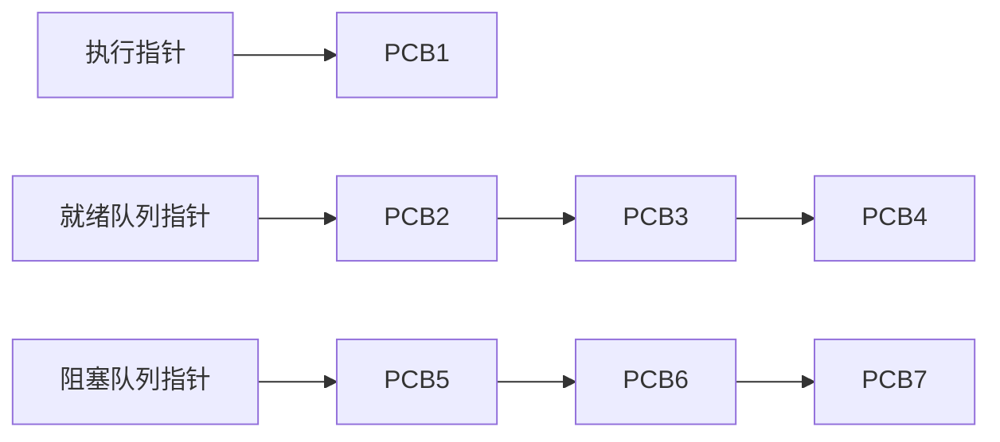
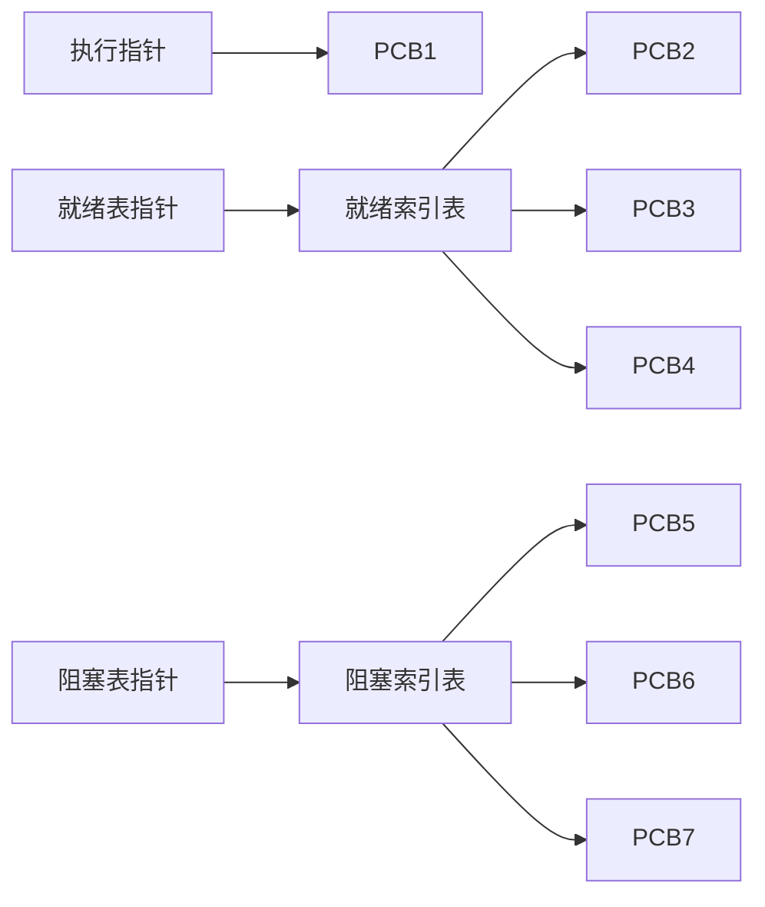
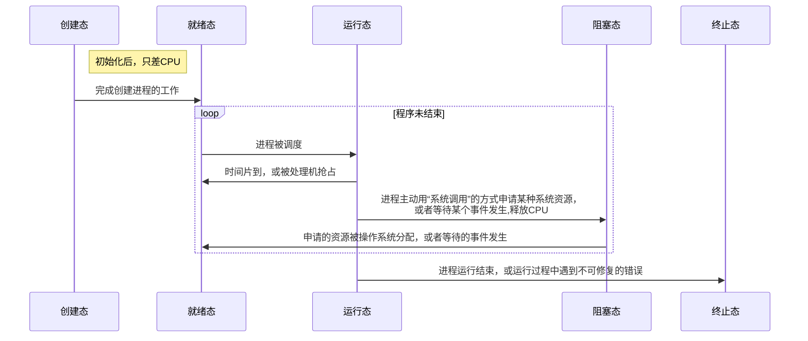

# 进程

程序：指令序列
当引入多道程序，操作系统开始出现，为了找到各个程序的程序段与数据段，以及各个程序被分配的系统资源，引入了进程，进程实体（进程映像）的概念
系统为每个运行的程序配置一个名为程序控制块（PCB）的数据结构，用以描述进程的各种信息
*def* 
程序段，数据段，PCB三部分组成了进程实体（进程映像 ）。一般情况下，我们把进程实体简称为进程，创建进程，实质上是创建PCB，撤销则是撤销进程实体中的PCB

1.  进程是程序的一次执行过程
2.  进程是一个程序及其数据在处理机上顺序执行时所发生的活动
3.  进程是具有独立功能的程序在数据剂盒上运行的过程，它是系统进行资源分配和调度的一个独立单位                                                                                                         进程是进程实体的运行过程，是系统进行资源分配和调度的一个独立单位（进程实体是静态的，而进程是动态的）

$$
进程
\begin{cases}
PCB& 操作系统通过PCB来管理进程，\\
    &其中包含操作系统对进程管理所需的各种信息\\\\
程序段& 程序代码存放\\\\
数据段& 程序运行时使用，产生的运算数据。\\
     &如全局变量，局部变量，宏定义的常量\\\\

\end{cases}
$$
 
 
### PCB
$$
PCB
\begin{cases}
进程描述信息&
	\begin{cases}
	进程标识符PID& 当进程被创建，操作系统为其分配的唯一，\\&不重复的ID，用以区分不同的进程\\
	用户标识符UID& \\
	\end{cases} \\\\
进程控制和管理信息&
	\begin{cases}
	进程当前状态& \\
	进程和优先级& \\
	\end{cases}\\\\
资源分配清单&
	\begin{cases}
	程序段指针& \\
	数据段指针& \\
	键盘& \\
	鼠标& \\
	\end{cases}\\\\
处理机相关信息& 
	\begin{cases}
	各种寄存器位置& 保存当前进程运行情况，\\&例如		程序计数器记录了程序执行到哪一句
	\end{cases}\\\\
\end{cases}
$$

---
## 进程的组织
为了管理系统内数量庞大的PCB，需要将PCB用适当的方式组织起来

链接与索引  两种都根据进程状态有三种指针，分别对应正在执行进程的执行指针，与指向将要运行的就绪队列的指针，以及处于阻塞状态进程的阻塞队列指针，对于单CPU系统，执行指针只会指向一个而就绪队列指针和阻塞队列指针在两种不同的组织中，指向不同的数据结构，链接指向的是序列的队头（这个序列是用优先权排序的）而索引则是索引表

### 链接

---
### 索引

---
## 进程的特征
$$
进程的特征
\begin{cases}
动态性（最基本）& 进程是程序的一次执行过程，是动态地产生，变化和消亡的。\\\\
并发性& 内存中有多个进程实体，各进程可并发执行\\\\
独立性& 进程是能独立运行，独立获得资源，独立接受调度的基本单位\\\\
异步性& 各进程按各自提供的，不可预知的速度向前推进，    \\&操作系统要提供“进程同步机制”来解决异步问题\\\\
结构性& 每个进程都会配置一个PCB，结构上进程由程序段，数据段，PCB组成
\end{cases}
$$

---
## 进程的状态转换
程序的执行中，有时在被CPU处理，有时在等待CPU，可见进程的状态会有各种变化，为了方便管理，需要操作系统对进程的状态进行划分

$$
进程的状态
\begin{cases}
运行态（Runing）& 占有CPU，并在CPU上运行(处理机有		   	       几个核，就有几个进程处于运行态)\\\\
就绪态（Ready）& 已经具备运行条件，但由于没有空闲      CPU，而暂时不能运行（万事俱备，只欠CPU）\\\\
阻塞态（Waiting/Blocked,亦称等待态）& 因等待某一	        事件或资源暂时不能运行（如打印机，等待读磁盘         结果，为了提高CPU利用率，\\&先将其它资源         分配到位，才可以获得CPU的服务）\\\\
创建态& 进程初始化，分配程序需要的内存空间和创建初始	        化PCB\\\\
终止态& 进程运行结束，或者由于bug导致进程无法执行下       去，需要撤销进程，回收分配给进程的资源\\&        （如打印机，内存区域），删除PCB
\end{cases}
$$

注意：不能由阻塞态直接转换为运行态，也不能由就绪态直接转换为阻塞态（进入阻塞态是进程主动请求）

---
## 进程控制

*def*进程控制的主要功能是对系统中的所有进程实施有效的管理，它具有创建新进程，撤销已有的进程，实现进程状态转换等功能